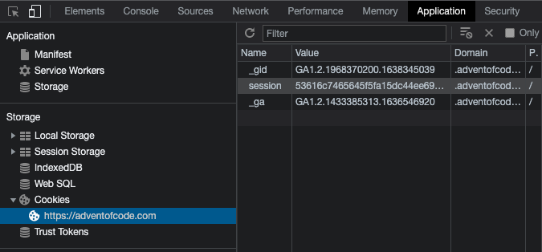

# 🎄 Advent of Code 2021 🎄

### Prep for new day.

_In an attempt to simplify the every day workflow I wrote a script to set up the initial working dirs, files and input from adventofcode.com. All you need to do is set the session cookie from advent of code in your repo and run the script with the current day like this:_

```shell
$ ./new_day.sh 06
```

1. get your session cookie from the developer tools in your browser and store it in a file called 'session_cookie.txt' in the root directory.



### Solutions: 

1. Go to the corresponding day folder (e.g. days/day01)

2. Run the following
```
python3 -m venv .venv
$ . .venv/bin/activate
(.venv) $ python3 -m pip install -r requirements.txt
(.venv) $ python3 main.py
```
